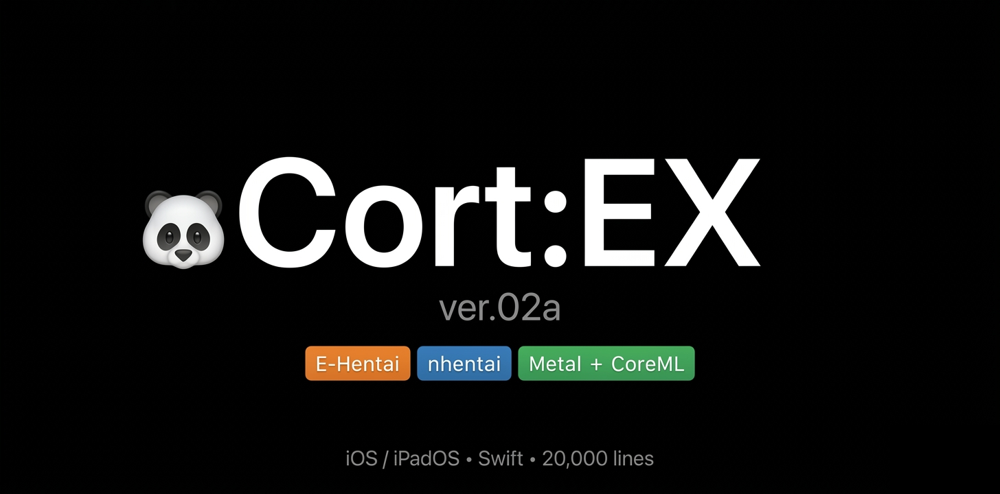
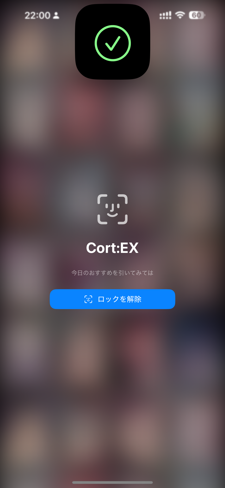

# Cort:EX ver.02a

**Unified E-Hentai / EXhentai / nhentai Viewer for iOS / iPadOS**

[English](README.md) | [中文](README_zh.md) | [日本語](README_ja.md)

---

## Demo

https://github.com/CielDevApp/CortEX/raw/main/assets/demo.mp4

> *Content blurred for privacy*

---

## Features

### Multi-Site Integration
- **E-Hentai / EXhentai** — Auto-switches based on login state. E-Hentai browsable without login
- **nhentai** — Full API integration, automatic Cloudflare bypass (WKWebView cf_clearance), WebP support
- **4-Layer Deleted Gallery Recovery** — nhentai (in-app search) → nyahentai.one → hitomi.la → title copy

### Reader
- **4 Modes** — Vertical scroll / Horizontal paging / iPad spread view / Pinch zoom
- **iPad Spread** — Auto landscape detection, 2-page composite rendering (zero-gap), wide images displayed solo
- **RTL / LTR** — Right-to-left and left-to-right binding with edge-tap page turning
- **Double-tap Zoom** — Live Text (text selection) support

### Image Processing (3 Engines)
- **CIFilter** — Tone curve, sharpening, noise reduction
- **Metal Compute Shader** — Direct GPU pipeline
- **CoreML Real-ESRGAN** — Neural Engine 4x super-resolution (tiled processing)
- **4-Level Quality** — Low → Low+Super-Res → Standard → Standard+Filter
- **HDR Enhancement** — Shadow detail recovery + vibrance + contrast

### Downloads
- **Bidirectional DL (Extreme Pincer)** — Simultaneous forward + backward download
- **Second Pass** — Auto-retry failed pages with exponential backoff
- **Live Activity** — Lock screen + Dynamic Island progress display
- **Read/Download Separation** — "Download remaining?" prompt on close

### Favorites
- **Dual Cache** — Independent E-Hentai / nhentai cache with disk persistence
- **nhentai Sync** — WKWebView SPA rendering → JavaScript ID extraction → API resolution
- **Search / Sort** — Date added (newest/oldest) / Title

### nhentai Detail View
- Title / Cover / Info (language, pages, circle, artist, parody)
- **Tag-tap Search** — One-tap search by artist:name, group:name, etc.
- Thumbnail grid → Tap to jump to page
- Filter pipeline (denoise / enhance / HDR)

### Security
- **Face ID / Touch ID** — Authentication on launch and resume
- **4-digit PIN** — Biometric fallback
- **App Switcher Blur** — Content hidden in task switcher
- **Keychain Encryption** — Secure cookie and credential storage

### Backup
- **PHOENIX MODE** — E-Hentai + nhentai unified JSON favorites backup
- **Extreme Safety Lock** — EXTREME MODE requires backup first
- **.cortex Export** — Gallery ZIP package

### Performance
- **ECO Mode** — NPU/GPU disabled, 30Hz, iOS Low Power Mode sync
- **EXTREME MODE** — All limiters removed (20 parallel, zero delay)
- **CDN Fallback** — i/i1/i2/i3 auto-switch + extension fallback (webp→jpg→png)

### Translation
- **Vision OCR** → Apple Translation API → Image burn-in
- 5 languages (JA/EN/ZH/KO/Auto)

### AI (iOS 26+)
- **Foundation Models** — Auto genre classification, tag recommendations

### UI/UX
- **TipKit (11 tips)** — Operation hints for all features, re-displayable from settings
- **8 Languages** — JA / EN / ZH-Hans / ZH-Hant / KO / DE / FR / ES
- **Dynamic Tabs** — Auto-switch E-Hentai ↔ EXhentai based on login
- **Benchmark** — CIFilter vs Metal speed test with device model display
- **Lock Screen Wallpaper** — Favorites gallery covers automatically appear as lock screen background (blurred until unlock)

- **Tab Bar Auto-Hide** — Scrolling down hides the tab bar for more content space

---

## Requirements
- iOS 18.0+ / iPadOS 18.0+ (iOS 26 / iPadOS 26 tested)
- iPhone / iPad (iPad spread mode supported)

## Installation

### Build from Source
1. Clone: `git clone https://github.com/CielDevApp/CortEX.git`
2. Open `EhViewer.xcodeproj` in Xcode 16+
3. Select your Team in Signing & Capabilities
4. Change Bundle Identifier to something unique (e.g. `com.yourname.cortex`)
5. Connect your device and hit Run

### Sideload (no Mac)
1. Download the IPA from [Releases](https://github.com/CielDevApp/CortEX/releases)
2. Install via AltStore, Sideloadly, or TrollStore

> Note: Free Apple Developer accounts have a 7-day signing limit. Use AltStore for auto-refresh.

## Built With
- Swift / SwiftUI
- 76 Swift files / ~20,000 lines
- Metal / CoreML / Vision / WebKit / ActivityKit / TipKit

## License
This project is licensed under the GPL-3.0 License - see the [LICENSE](LICENSE) file for details.

## Support
Support development on [Patreon](https://www.patreon.com/c/Cielchan).
